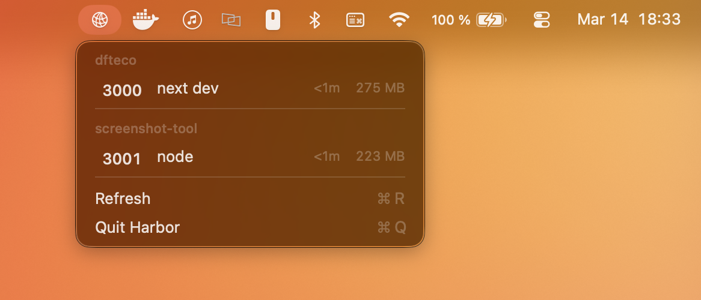

# Harbor

Tiny macOS menu bar app that shows your listening dev server ports — grouped by project, with uptime, memory usage, and one-click kill.



## Features

- Detects listening TCP ports via native `libproc` APIs (no `lsof` subprocess)
- Groups ports by project folder (resolved from process working directory)
- Shows process name, uptime, and memory usage
- Kill button appears on hover — terminates the process with SIGTERM
- Filters to dev ports by default (3000–9999, node/python/docker etc.), hides system noise
- Auto-refreshes every 5 seconds
- 232 KB, no dependencies, no Dock icon

## Install

```bash
# Build from source
xcodegen generate
xcodebuild -project Harbor.xcodeproj -scheme Harbor -configuration Release build -quiet
cp -R ~/Library/Developer/Xcode/DerivedData/Harbor-*/Build/Products/Release/Harbor.app /Applications/
```

## Requirements

- macOS 14+
- Xcode 16+ (to build)
- [XcodeGen](https://github.com/yonaskolb/XcodeGen) (`brew install xcodegen`)
